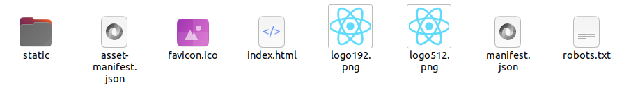
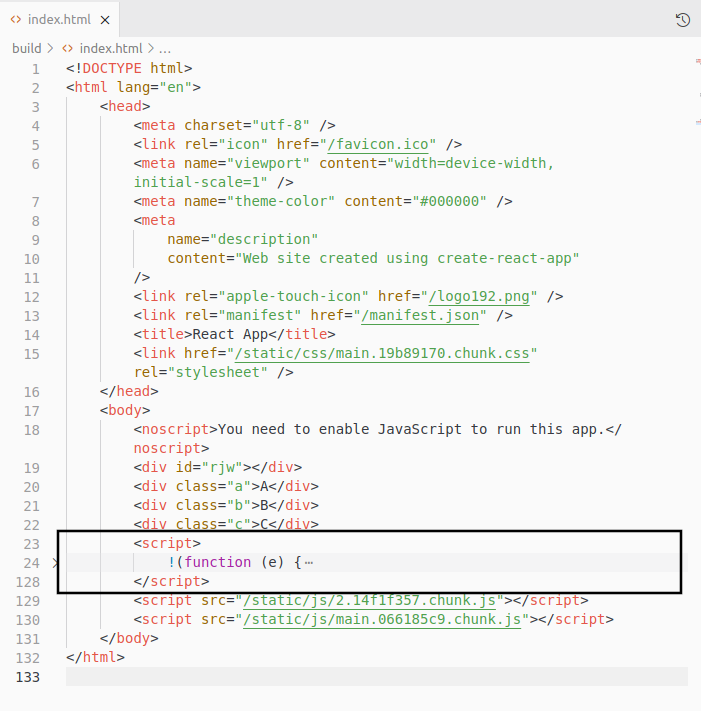
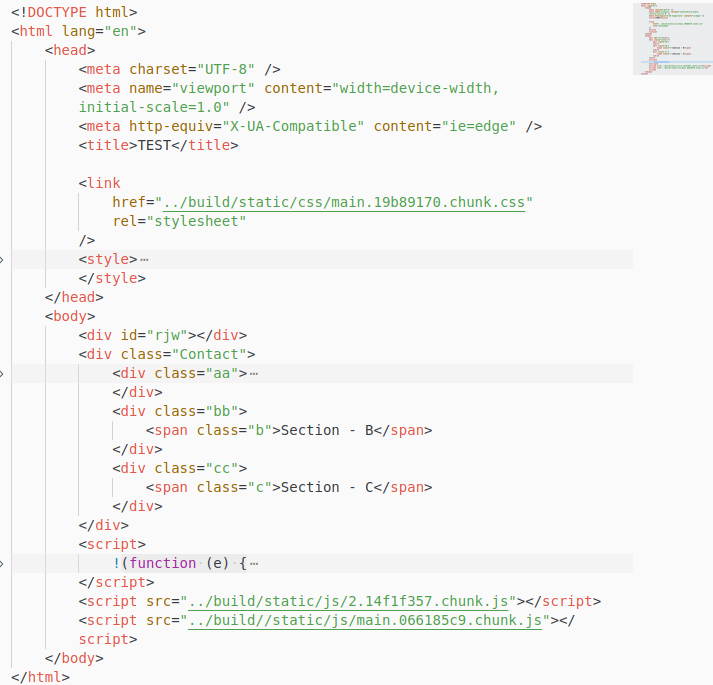

Reference: [Levelup](https://levelup.gitconnected.com/the-two-easiest-ways-to-share-your-reactjs-project-as-a-widget-971dfef66d98)

#### Steps:
- Build Project:  
```
yarn build
```
- You will have a build directory created by react. It will look like this:  


- To include the widget into your html based project:  

	- Open the static folder and copy/link the css file inside of the css folder into your html project
	- Open the static folder and copy/link the 2 js file inside of the js folder into your html project. These file ends with 'chunk.js'
	- Copy this script and add that to your html project:  
	
	- Your html page should contain a div tag with id = "rjw"

You are gtg

Finally your page should look like this:  
 

PS: Since the api is not integrated rn. Please make sure to have 3 elements with classes .a .b and .c to have a ride.
